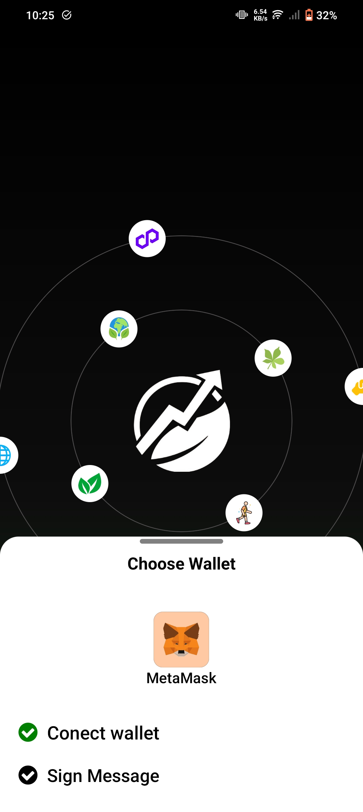
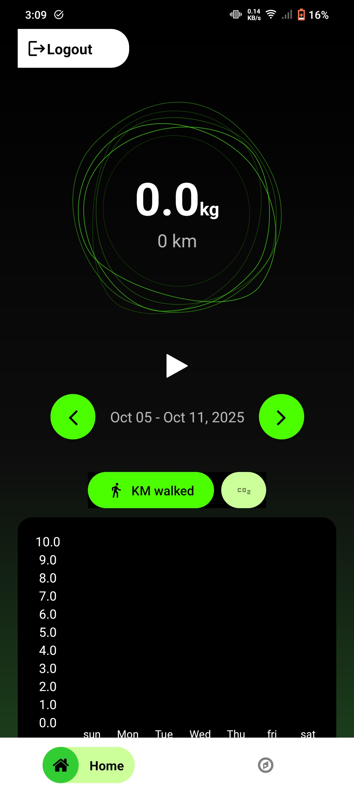
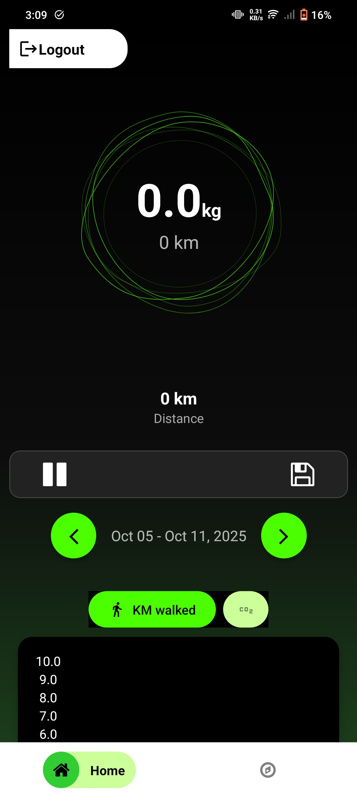
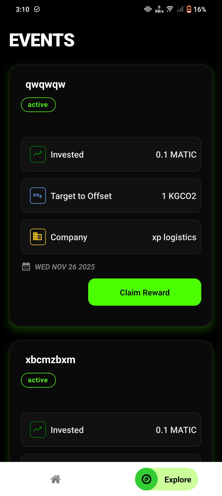
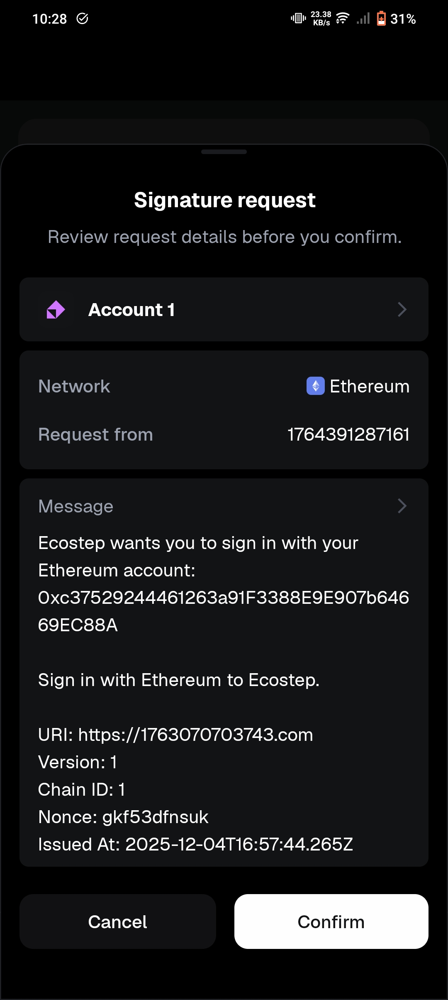
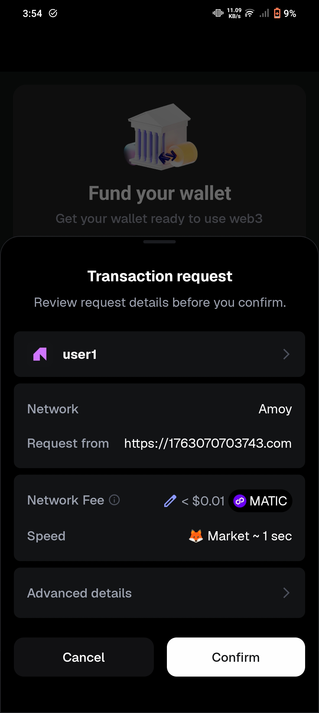

# 🌱 Ecostep

**Ecostep** is a React Native mobile application built around an activity-based rewards and investment concept.

The platform encourages users to stay physically active by completing walking-based activities and earning points. These points can be used to unlock invested money, while investors can sponsor users' goals and receive certification for their participation.

---

## 🚀 Key Features

* 🚶 **Activity-Based Rewards**
  Users earn points by completing walking-based activities.

* 📍 **Activity Tracking**
  The application tracks walking activity and distance using mobile device data.

* 🏆 **Reward System**
  Users can accumulate points through their activities and use them to unlock invested funds.

* 💰 **Investment & Sponsorship**
  Investors can sponsor users' goals and create personalized incentives.

* 🔐 **Wallet Integration**
  Users can connect their Web3 wallet to interact with the platform.

* ✍️ **Sign-In with Ethereum (SIWE)**
  The application includes wallet-based authentication using Sign-In with Ethereum.

* 📊 **Dashboard**
  Users can view their activity, progress, and rewards.

* 🔎 **Explore**
  Users can explore available activities and opportunities within the platform.

---

# 📱 Screenshots

## Connect Wallet

<p align="center">
  
</p>

## Dashboard

<p align="center">
  
  
</p>

## Explore

<p align="center">
  
</p>

## Sign-In with Ethereum

<p align="center">
  
</p>

## Successful Payment

<p align="center">
  
</p>

---

# 🛠️ Tech Stack

* **React Native** — Mobile application development
* **JavaScript** — Primary application language
* **Java** — Android native components
* **Objective-C** — iOS native components
* **Node.js / npm** — Dependency and project management
* **Jest** — Testing
* **Metro** — React Native JavaScript bundler
* **Web3 / Ethereum** — Wallet and authentication integration
* **SIWE** — Sign-In with Ethereum

---

# 🏗️ Project Structure

```text
Ecostep/
│
├── android/                # Android native project
├── ios/                    # iOS native project
│
├── src/                    # Application source code
├── contexts/               # React context/state management
├── __tests__/              # Test files
│
├── App.jsx                 # Main application component
├── AppWithProviders.jsx    # Application with context providers
├── index.js                # Application entry point
│
├── app.json                # React Native application configuration
├── babel.config.js         # Babel configuration
├── metro.config.js         # Metro bundler configuration
├── jest.config.js          # Jest configuration
├── tsconfig.json           # TypeScript configuration
│
├── package.json            # Dependencies and scripts
├── package-lock.json       # Locked dependency versions
│
├── Gemfile                 # Ruby dependencies for native tooling
│
├── connectwallet.jpg       # Connect wallet screenshot
├── dashboard.jpg           # Dashboard screenshot
├── dashboardscreen.jpg     # Dashboard screen screenshot
├── explorepage.jpg         # Explore page screenshot
├── siwe.jpg                # SIWE screenshot
└── sucessfullpayment.jpg   # Successful payment screenshot
```

---

# 🔐 Authentication

Ecostep includes **Sign-In with Ethereum (SIWE)** for wallet-based authentication.

The basic authentication flow is:

```text
User
  │
  ▼
Connect Wallet
  │
  ▼
Request Sign-In Message
  │
  ▼
User Signs Message
  │
  ▼
Authentication
  │
  ▼
Access Ecostep
```

This allows users to authenticate using their Web3 wallet instead of relying only on traditional username/password authentication.

---

# 📍 Activity & Distance Tracking

Ecostep uses mobile location/activity data to track walking-based activities.

The application processes GPS readings to calculate movement distance. Suspicious or inaccurate readings are filtered to reduce incorrect distance calculations.

The distance calculation uses geographical coordinates and calculates the distance between GPS points before accumulating the user's total distance.

This helps prevent unrealistic GPS readings from incorrectly increasing a user's activity progress.

---

# 💡 How Ecostep Works

The core concept can be represented as:

```text
        User
          │
          ▼
   Connect / Sign In
          │
          ▼
   Complete Activity
          │
          ▼
   Track Walking Data
          │
          ▼
    Calculate Progress
          │
          ▼
      Earn Points
          │
          ▼
   Unlock Investment
```

Investors can participate by sponsoring users' goals, creating a personalized incentive system between users and investors.

---

# ⚙️ Getting Started

## Prerequisites

Make sure you have the React Native development environment configured.

You will need:

* Node.js
* npm or Yarn
* Android Studio for Android development
* Xcode for iOS development
* Android Emulator or physical Android device
* iOS Simulator or physical iOS device for iOS development

Follow the official [React Native Environment Setup](https://reactnative.dev/docs/environment-setup) guide for platform-specific requirements.

---

## Installation

Clone the repository:

```bash
git clone https://github.com/praxjt/Ecostep.git
```

Navigate to the project:

```bash
cd Ecostep
```

Install dependencies:

```bash
npm install
```

---

# ▶️ Running the Application

## Start Metro

```bash
npm start
```

Keep Metro running in its own terminal.

## Android

Open another terminal and run:

```bash
npm run android
```

## iOS

For iOS:

```bash
npm run ios
```

---

# 🧪 Testing

The project includes a `__tests__` directory and Jest configuration.

Run the test suite using:

```bash
npm test
```

---

# 📂 Main Application Components

### `App.jsx`

The main entry component of the React Native application.

### `AppWithProviders.jsx`

Wraps the application with the required React context providers.

### `contexts/`

Contains context-related functionality used for sharing application state across components.

### `src/`

Contains the main application source code, including screens and supporting functionality.

### `android/`

Contains the native Android project.

### `ios/`

Contains the native iOS project.

---

# 🌱 Project Goal

Ecostep aims to combine **physical activity, financial incentives, and Web3 technology** to encourage healthier and more sustainable user behavior.

The platform creates a connection between:

**Users → Activities → Rewards → Investments**

while allowing investors to participate by sponsoring users' goals.

---
**Repository:** [Ecostep](https://github.com/praxjt/Ecostep)
